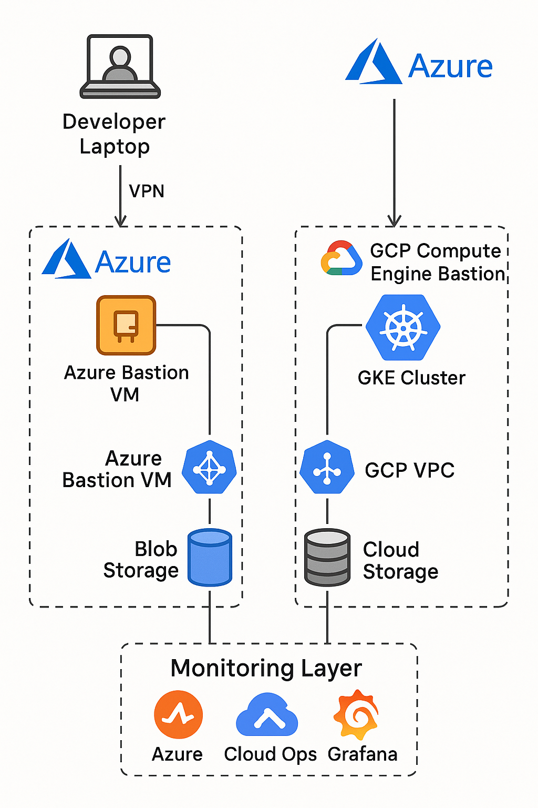

# FuelAI.Infrastructure.project

# Fuel.AI Cloud Infrastructure Project

This repository documents a **7-day multi-cloud infrastructure project** showcasing cloud automation, security, and monitoring.  
The project is designed to simulate an **AI data pipeline** for a company like **Fuel.AI**, leveraging **Azure + GCP**.

---

## **Day 1: Architecture & Design**
### **Goals**
- Design a multi-cloud architecture using Azure (AKS, Blob Storage) and GCP (GKE, Cloud Storage).
- Prepare for automated deployments with Infrastructure-as-Code (Terraform).

### **Architecture Diagram**


---

## **Project Overview**
- **Clouds:** Azure & GCP
- **Services:** AKS, GKE, Blob Storage, Cloud Storage, Azure Monitor, GCP Cloud Ops
- **Tools:** Terraform, Docker, Kubernetes, Grafana


---

## 📅 Day 2: Azure Infrastructure Deployment (Terraform)

### ✅ Resources Deployed
Using Terraform, the following Azure resources were successfully deployed:

- **Resource Group:** `fuelai-rg` – Logical container for managing assets
- **Virtual Network (VNet):** `fuelai-vnet` – Private, secure network for workloads
- **Subnet:** `fuelai-subnet` – Segmented portion of the VNet for compute resources
- **Storage Account:** `fualaistorage` – Blob storage for AI datasets and pipeline staging

These resources lay the foundation for secure, scalable, and cloud-native AI workloads to be run in Azure (e.g., AKS, containerized data processors).

---

## 🛠️ Azure CLI + Terraform Troubleshooting Guide

This section documents **real-world issues encountered and solved** during Day 2 of the Fuel.AI Cloud Infrastructure Project. These reflect actual roadblocks I faced while building infrastructure using Terraform and Azure CLI on a Linux machine.

---

### 🔐 Authentication Errors

**❌ Error:**
ERROR: Please run 'az login' to setup account.

**✅ What I Did:**
```bash
az login --use-device-code
az account show


🧾 Missing Subscription or Tenant ID
❌ Error:
cpp
Copy
Edit
tenant ID was not specified and the default tenant ID could not be determined

✅ What I Did:
Retrieved subscription and tenant IDs:

bash
Copy
Edit
az account show --output json
Added them manually to the provider block in main.tf:

hcl
Copy
Edit
provider "azurerm" {
  features {}
  subscription_id = "<my-subscription-id>"
  tenant_id       = "<my-tenant-id>"
}


🧩 Invalid Subscription ID
❌ Error:

pgsql
Copy
Edit
The provided subscription ID '...' is not known by Azure CLI

✅ What I Did:

Checked for typos or missing characters.

Copied fresh ID with:

bash
Copy
Edit
az account show
Pasted directly into main.tf.

🧱 Locked APT (Linux Package Manager)
❌ Error:
csharp
Copy
Edit
Could not get lock /var/lib/dpkg/lock-frontend

✅ What I Did:
bash:
Copy
Edit
ps aux | grep apt
sudo kill -9 <PID>
sudo rm /var/lib/dpkg/lock-frontend
sudo dpkg --configure -a


🔒 Resource Provider Registration Fails
❌ Error:

go
Copy
Edit
Encountered an error whilst ensuring Resource Providers are registered. HTTP response was nil
✅ What I Did:
Went to Azure Portal → Subscriptions → Resource Providers
Manually registered:
Microsoft.Storage
Microsoft.Network
Microsoft.ManagedIdentity

Re-ran:
bash:
Copy
Edit
terraform apply


🌐 CLI Token Issues
❌ Error:
nginx
Copy
Edit
could not configure AzureCli Authorizer

✅ What I Did:
bash
Copy
Edit
az logout
az login --use-device-code


** After resolving issues, I always verified:

bash:
Copy
Edit
az account show
az account list --output table
Then continued with:

bash:
Copy
Edit
terraform init
terraform plan
terraform apply


## 📅 Day 2 (Part 2): GCP Infrastructure Deployment (Terraform)

Today I deployed foundational cloud infrastructure to Google Cloud Platform using Terraform, mirroring what was built in Azure. The purpose of this step is to demonstrate multi-cloud readiness and build a scalable, secure environment for AI data ingestion, processing, and storage.

All work was performed inside the following directory:
fuelai-cloud-infra-project/terraform/gcp/

To confirm I was in the correct directory, I used:
pwd
ls
# Confirmed the presence of main.tf

From there, I began the Terraform deployment process. First, I authenticated with GCP:
gcloud auth application-default login

Then I set the correct active project:
gcloud config set project your-project-id

Before proceeding, I enabled the following essential GCP APIs to allow Terraform to provision resources:
- Compute Engine API
- Cloud Storage API
- Identity and Access Management (IAM) API
- Cloud Resource Manager API
- Service Usage API
- Kubernetes Engine API

I enabled these APIs using either the GCP console or via CLI:
gcloud services enable compute.googleapis.com storage.googleapis.com iam.googleapis.com cloudresourcemanager.googleapis.com serviceusage.googleapis.com container.googleapis.com

With credentials and configuration in place, I initialized Terraform:
terraform init

Then I ran a preview plan:
terraform plan

And finally applied the changes to deploy infrastructure:
terraform apply

The resources deployed were:
- A Virtual Private Cloud named `fuelai-vpc`
- A Subnet named `fuelai-subnet`
- A Cloud Storage Bucket named `fuelai-ml-datasets`

These resources serve specific purposes in Fuel.AI's future cloud-native architecture:
The VPC creates an isolated and secure network environment for data processing workflows.
The Subnet logically divides IP space for future compute workloads like GKE.
The Cloud Storage Bucket provides secure object storage for incoming, anonymized user data and AI training sets.

During this deployment, I encountered and resolved several GCP-specific errors and misconfigurations.

Error:
(gcloud.auth.application-default.login) https://www.googleapis.com/auth/cloud-platform scope is required but not consented.
Fix:
Re-ran the login and made sure to consent fully:
gcloud auth application-default login
For headless use:
gcloud auth application-default login --no-browser

Error:
Attempted to load application default credentials since neither credentials nor access_token was set in the provider block. No credentials loaded.
Fix:
Confirmed authentication:
gcloud auth application-default login
Verified token:
gcloud auth application-default print-access-token
Then manually set the environment variable:
export GOOGLE_APPLICATION_CREDENTIALS="$HOME/.config/gcloud/application_default_credentials.json"

Error:
(gcloud.compute.networks.list) The required property [project] is not currently set.
Fix:
Set the active project with:
gcloud config set project your-project-id
Confirmed with:
gcloud config list

Warning:
Your active project does not match the quota project in your local Application Default Credentials file.
Fix:
Synced the quota project using:
gcloud auth application-default set-quota-project your-project-id

Error:
Invalid block definition on main.tf line XX, in resource "google_storage_bucket" "fuel_bucket":
XX:   force destroy = true
Fix:
Corrected to:
force_destroy = true
Ensured proper syntax by using underscores (_) instead of spaces.

Error:
Error 403: Permission denied on resource project
Error 400: Unknown project id: , invalid
Fix:
Listed projects to confirm:
gcloud projects list
Set the correct project again:
gcloud config set project your-project-id
Aligned the quota project:
gcloud auth application-default set-quota-project your-project-id
Then verified access:
gcloud compute networks list

Final verification checklist included:
gcloud config list
gcloud auth application-default print-access-token
terraform plan
terraform apply

All steps were completed on a Linux machine. The GCP infrastructure now mirrors the Azure environment and supports Fuel.AI's objective of building a secure, multi-cloud foundation for AI dataset management and model training pipelines.


---

## **Roadmap**
- **Day 1:** Architecture & Planning (This README)
- **Day 2:** Terraform setup for Azure & GCP (VNet/VPC + storage + bastion host)
- **Day 3:** Kubernetes clusters (AKS + GKE) & container deployment
- **Day 4:** Data pipeline simulation
- **Day 5:** Security & IAM
- **Day 6:** Monitoring & logging
- **Day 7:** Documentation & final polish

